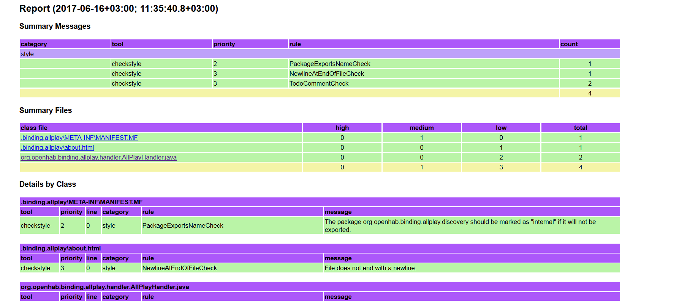
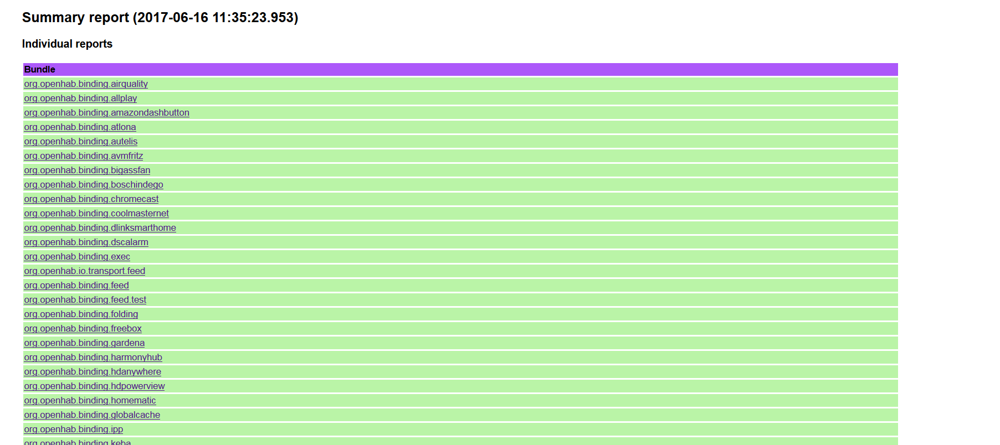

# Usage

The Static Code Analysis Tools is a Maven plugin that executes the Maven plugins for SpotBugs, Checkstyle and PMD and generates a merged .html report.

Add the following profiles to your pom.xml:

```
  <profile>
    <id>check</id>
    <build>
      <pluginManagement>
        <plugins>
          <plugin>
            <groupId>org.openhab.tools.sat</groupId>
            <artifactId>sat-plugin</artifactId>
            <version>${sat.version}</version>
            <executions>
              <execution>
                <phase>verify</phase>
                <goals>
                  <goal>checkstyle</goal>
                  <goal>pmd</goal>
                  <goal>spotbugs</goal>
                  <goal>report</goal>
                </goals>
              </execution>
            </executions>
          </plugin>
        </plugins>
      </pluginManagement>
    </build>
  </profile>
  <profile>
    <id>check-bundles</id>
    <activation>
      <file>
        <exists>src</exists>
      </file>
    </activation>
    <build>
      <plugins>
        <plugin>
            <groupId>org.openhab.tools.sat</groupId>
            <artifactId>sat-plugin</artifactId>
        </plugin>
      </plugins>
    </build>
  </profile>
```

 Execute `mvn clean install -P check` from the root of your project.

 Reports are generated for each module individually and can be found in the `target/code-analysis` directory:



The summary report can be found in the root target directory:



The build will fail if a problem with high priority is found by some of the Maven plugins for PMD, Checkstyle and SpotBugs.
Each of the plugins has its own way to prioritize the detected problems:

 - for PMD - the build will fail when a rule with Priority "1" is found;
 - for Checkstyle - a rule with severity="Error";
 - for SpotBugs - any Matcher with Rank between 1 and 4.

## Maven plugin goals and parameters

The Static Analysis tool includes several goals:

- [pmd](#sat-pluginpmd);
- [checkstyle](#sat-plugincheckstyle);
- [spotbugs](#sat-pluginspotbugs);
- [report](#sat-pluginreport).

Below you can find detailed information what each goal does and how it can be configured.

### sat-plugin:pmd

Description:
    Executes the `maven-pmd-plugin` goal `pmd` with a ruleset file and configuration properties

Parameters:

| Name | Type| Description |
| ------ | ------| -------- |
| **pmdRuleset** | String | Relative path of the XML configuration to use. If not set the default ruleset file will be used |
| **pmdFilter** | String | Relative path of a suppression.properties file that lists classes and rules to be excluded from failures. If not set no classes and no rules will be excluded |
| **maven.pmd.version** | String | The version of the maven-pmd-plugin that will be used (Default value is **3.26.0**)|
| **pmdPlugins** | List<Dependency> | A list with artifacts that contain additional checks for PMD |

### sat-plugin:checkstyle

Description:
    Executes the `maven-checkstyle-plugin` goal `checkstyle` with a ruleset file and configuration properties

Parameters:

| Name | Type| Description |
| ------ | ------| -------- |
| **checkstyleRuleset** | String | Relative path of the XML configuration to use. If not set the default ruleset file will be used |
| **checkstyleFilter** | String | Relative path of the suppressions XML file to use. If not set the default filter file will be used |
| **maven.checkstyle.version** | String | The version of the maven-checkstyle-plugin that will be used (default value is **3.6.0**)|
| **checkstylePlugins** | List<Dependency> | A list with artifacts that contain additional checks for Checkstyle |
| **checkstyleProperties** | String | Relative path of the properties file to use in the ruleset to configure specific checks |

### sat-plugin:spotbugs

Description:
    Executes the `spotbugs-maven-plugin` goal `spotbugs` with a  ruleset file and configuration properties

Parameters:

| Name | Type| Description |
| ------ | ------| -------- |
| **spotbugsRuleset** | String | Relative path to the XML that specifies the bug detectors which should be run. If not set the default file will be used|
| **spotbugsInclude** | String | Relative path to the XML that specifies the bug instances that will be included in the report. If not set the default file will be used|
| **spotbugsExclude** | String | Relative path to the XML that specifies the bug instances that will be excluded from the report. If not set the default file will be used|
| **maven.spotbugs.version** | String | The version of the spotbugs-maven-plugin that will be used (default value is **4.9.8.2**) |
| **spotbugs.version** | String | The version of SpotBugs that will be used (default value is **4.9.8**) |
| **spotbugsPlugins** | List<Dependency> | A list with artifacts that contain additional detectors/patterns for SpotBugs |
| **findbugs.slf4j.version** | String | The version of the findbugs-slf4j plugin that will be used (default value is **1.5.0**)|

### sat-plugin:report

Description:
    Transforms the results from SpotBugs, Checkstyle and PMD into a single HTML Report with XSLT

Parameters:

| Name                         | Type| Description                                                                                                                                                          |
|------------------------------| ------|----------------------------------------------------------------------------------------------------------------------------------------------------------------------|
| **report.targetDir**         | String | The directory where the individual report will be generated (default value is **${project.build.directory}/code-analysis**)                                          |
| **report.summary.targetDir** | String | The directory where the summary report, containing links to the individual reports will be generated (Default value is **${session.executionRootDirectory}/target**) |
| **report.fail.on.error**     | Boolean | Describes of the build should fail if high priority error is found (Default value is **true**)                                                                       |
| **report.fail.on.warning**   | Boolean | Describes of the build should fail if warning is found (Default value is **false**)                                                                                  |
| **report.fail.on.info**      | Boolean | Describes of the build should fail if info is found (Default value is **false**)                                                                                     |
| **report.in.maven**          | Boolean | Enable/Disable maven console logging of all messages (Default value is **true**)                                                                                     |

## Customization

Different sets of checks can be executed on different types of projects.

The tool executes different checks on OSGi bundles and openHAB add-ons.
It uses default configuration files for SpotBugs, Checkstyle and PMD that are stored in `sat-plugin/src/main/resources/configuration`.

If you want to use a custom set of rules you will have to set the configuration parameters for the individual MOJOs.
An example configuration may look like this;

```
  <plugin>
    <groupId>org.openhab.tools.sat</groupId>
    <artifactId>sat-plugin</artifactId>
    <configuration>
      <checkstyleRuleset>build-tools/checkstyle/addon.xml</checkstyleRuleset>
      <checkstyleFilter>build-tools/checkstyle/suppressions.xml</checkstyleFilter>
      <pmdRuleset>build-tools/pmd/addon.xml</pmdRuleset>
      <pmdFilter>build-tools/pmd/suppressions.properties</pmdFilter>
      <spotbugsInclude>build-tools/spotbugs/addon.xml</spotbugsInclude>
      <spotbugsExclude>build-tools/spotbugs/exclude.xml</spotbugsExclude>
      <spotbugsRuleset>build-tools/spotbugs/visitors.xml</spotbugsRuleset>
    </configuration>
  </plugin>
```

Information about the syntax of the configuration files (except the `visitors.xml`) can be found on the web pages of the individual plugins.

The `visitors.xml` contains a list with SpotBugs visitors (bug detectors) and has the following syntax:

```
<?xml version="1.0" encoding="UTF-8"?>
<visitors>
  <visitor>AtomicityProblem</visitor>
  ...
<visitors/>
```

### Individual plugin customization

Each of the Maven plugins that are used (for SpotBugs, Checkstyle and PMD) are configured by setting user properties that are located in the `sat-plugin/src/main/resources/configuration` directory.

You can refer to the following links for more configuration options for the specific Maven plugins:

- https://maven.apache.org/plugins/maven-pmd-plugin/check-mojo.html;
- https://maven.apache.org/plugins/maven-checkstyle-plugin/checkstyle-mojo.html;
- https://spotbugs.github.io/spotbugs-maven-plugin/spotbugs-mojo.html.

## Reuse Checks

PMD, Checkstyle and SpotBugs come with a set of custom rules that can be used directly in a rule set.

Helpful resources with lists of the available checks and information how to use them:

- for PMD - https://pmd.github.io/latest/pmd_rules_java.html;
- for Checkstyle - https://checkstyle.sourceforge.io/checks.html;
- for SpotBugs - https://spotbugs.readthedocs.io/en/latest/implement-plugin.html.
